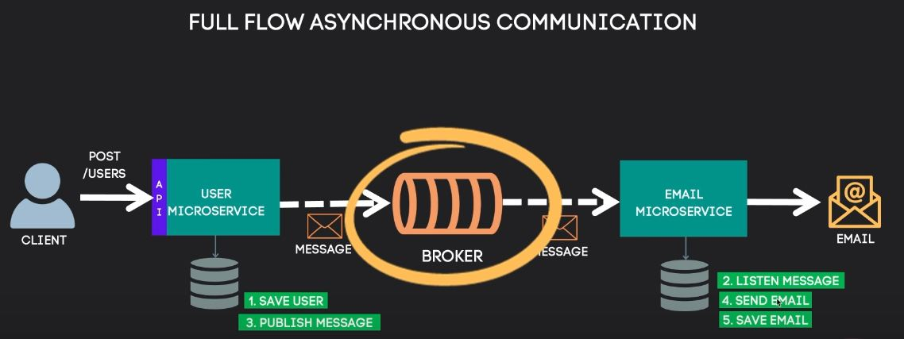

# 📨 Sistema de Envio de E-mails com Microservices

Este projeto é um sistema de microserviços construído com **Spring Boot**, **RabbitMQ**, **PostgreSQL** e **Docker**, com comunicação assíncrona entre os serviços.

## 📌 Tecnologias Utilizadas

- Java 17
- Spring Boot
- RabbitMQ (mensageria)
- PostgreSQL
- Docker & Docker Compose
- SMTP (envio de e-mails via Gmail)
- JPA / Hibernate

## 🧱 Estrutura dos Microserviços

- `user-service`: responsável por cadastrar usuários e enviar mensagens para a fila de e-mails.
- `email-service`: escuta a fila e envia e-mails utilizando SMTP do Gmail.

## 📡 Comunicação Assíncrona

Os microserviços se comunicam via **RabbitMQ** usando uma fila chamada `default.email`.  
O `user-service` envia os dados do e-mail para a fila, e o `email-service` consome e envia o e-mail de fato.

## 🖼️ Fluxo da Aplicação



## 🐳 Como Executar com Docker

### Pré-requisitos

- Docker
- Docker Compose

### 1. Clonar o repositório

```bash
git clone https://github.com/seu-usuario/seu-repo.git
cd microserviceEnvioEmail
```

### 2. Criar um arquivo `.env` na raiz

Crie um arquivo chamado `.env` com o seguinte conteúdo:

```env
# RabbitMQ
RABBITMQ_USER=rabbitmq
RABBITMQ_PASS=rabbitmq

# PostgreSQL
POSTGRES_USER=postgres
POSTGRES_PASSWORD=postgres

# SMTP Gmail
SPRING_MAIL_USERNAME=seu-email@gmail.com
SPRING_MAIL_PASSWORD=sua-senha-de-app
```

> ⚠️ Use uma **senha de app do Gmail**, não sua senha principal. Ative a autenticação em 2 fatores para gerar essa senha.

### 3. Gerar os JARs dos serviços

```bash
cd user && ./mvnw clean package
cd ../email && ./mvnw clean package
cd ..
```

### 4. Subir os containers

```bash
docker-compose --env-file .env up --build
```

## 🔗 Acessos

| Serviço         | URL                       |
|----------------|----------------------------|
| RabbitMQ       | http://localhost:15672     |
| User Service   | http://localhost:8081      |
| Email Service  | http://localhost:8082      |
| PostgreSQL     | localhost:5432             |

## ✉️ Exemplo de fluxo

1. `POST /users` no `user-service` → cria usuário e envia evento via RabbitMQ.
2. `email-service` consome o evento da fila e envia um e-mail via Gmail.

## 🔧 Arquitetura

- Microserviços independentes
- Comunicação assíncrona (RabbitMQ)
- Containers isolados (Docker)
- Banco de dados separado por serviço

---

## 📬 Contato

Desenvolvido por **Lucas Lopes** – _Projeto baseado em videoaulas sobre microsserviços com Spring_.
